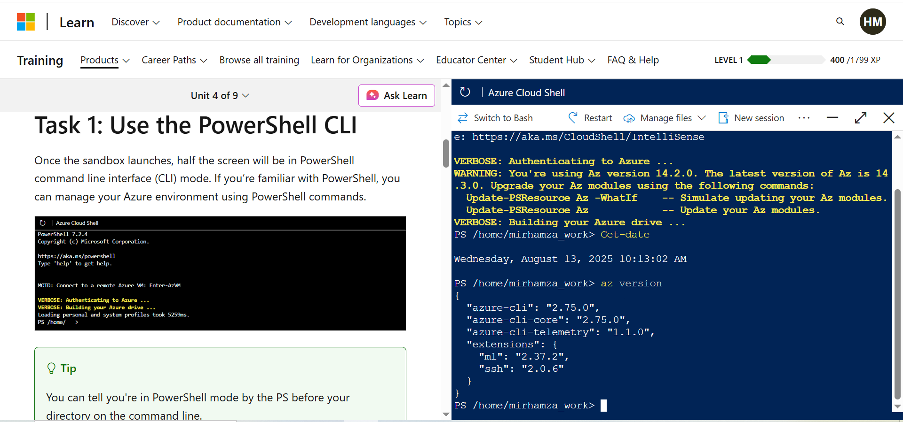
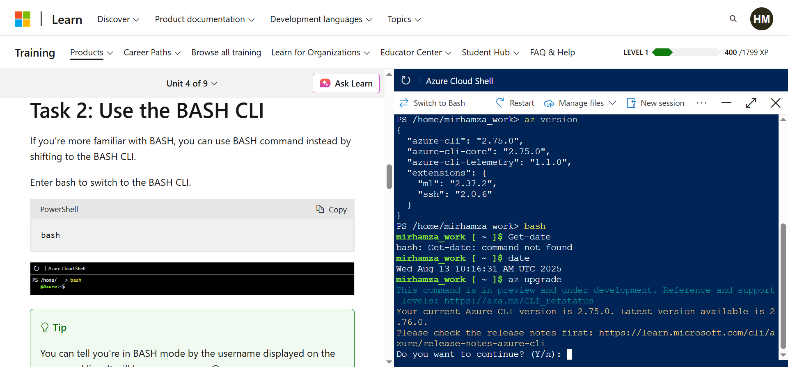
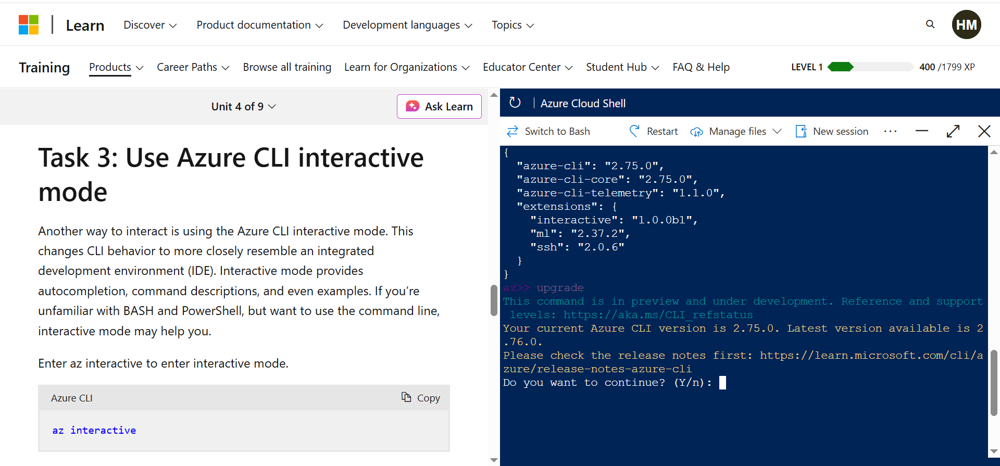
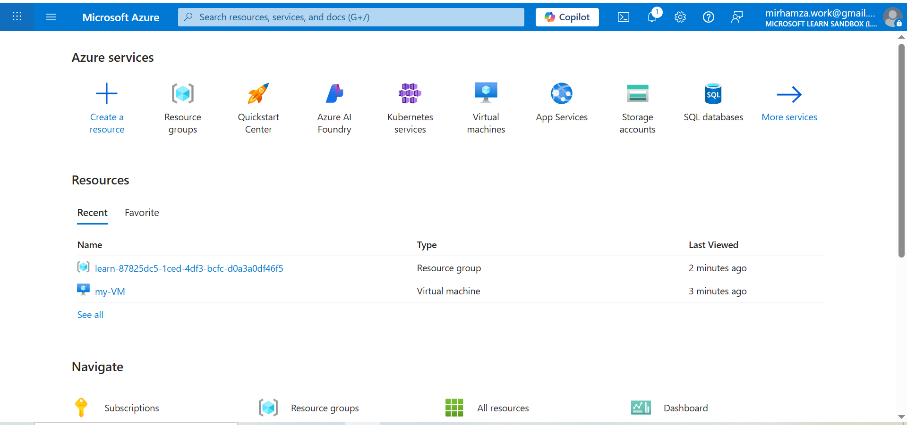
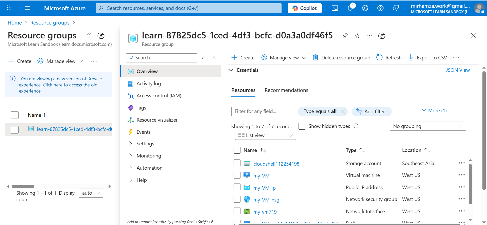

# Excercie 1: Exploring Learn Sandbox

## Tasks

### 1. Task 1: 

### 2. Task 2:

### 3. Task 3:

# Exercise 2: Creating a VM and accessing Resource Group

## Steps Taken
1. Logged into Azure Portal.
2. Clicked "Virtual Machine" in the left menu.
3. Clicked "Create".
4. Followed mentioned steps to fill the info.
5. Clicked "Review + create" then "Create".

## Tasks

### Task 1;

### Task 2:

